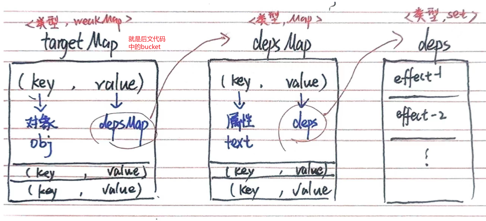

# 响应式系统

刚开始学习响应式系统的原理，网上查阅了很多文章，我太菜了看不懂，最终还是感觉《Vue.js设计与实现》书上写的最清晰。

在此记录下学习思考的过程。

## 一个不考虑任何细节的响应式系统

### “响应式”究竟在干嘛？

先来看一段代码

```js
01 const obj = { text: 'hello world' }
02 function effect() {
03     document.body.innerText = obj.text
04 }
05 effect();
06 obj.text = 'hello vue3' 
```

我有一个对象obj，对象里面定义了一个属性text，属性有自己的值。

我还有一个函数，这个函数目的是让网页的body元素中显示obj.text 的值。然后我调用它。

最后我修改了obj.text 的值。但很显然我修改之后，没有去调用，那么这个时候网页中的文本不会自动更新成新值显示。

**这个场景下，响应式的目的就是，让网页中的文本时时显示最新的值，让它自动更新！**

### 怎么让它响应起来呢？

也就是说，我们希望，在进行`obj.text = 'hello vue3' `修改的时候，会自动触发上面的effect函数。

要想实现这个过程，就得好好设计设计了。

1. 怎么知道要触发的是effect()，而不是什么其他乱起八糟的东西呢？这个时候就需要一个桶，即“obj.text专用桶”，把effect存起来。
2. 什么时候把effect()放进桶里呢？ 在我们读取obj.text的时候，把它放“obj.text专用桶”里。**（即谁用到了我的值，我就把谁放到我的专用桶里面；当我发生修改的时候，就把专用桶里面所有函数重新执行一遍）**

好了，现在新的过程就是，我在05行调用effect函数的时候，发现自己用到了obj.text这个东西，所以偷偷把函数的名字收集到一个专用桶里；在06行修改obj.text的时候，我到专用桶里取出来之前收集的effect函数，偷偷重新执行一遍。这样是不是就能做到网页里的文本实时都是最新值啦~

### 设计桶

好的，核心思路已经清楚了，但我们不能一直用大白话，咱得了解点专业名词。

- effect()函数，学名**副作用函数**。副作用函数指的是会产生副作用的函数，它执行会改变函数本身区域外的变量，或者说直接或间接影响其他事务的执行。
- **响应式数据**，当数据的值发生变化的时候，所有跟它相关联的事务（可以理解为副作用函数）能随即更新，这就是响应式数据。
- **依赖**，用到了某个响应式数据的副作用函数 叫做这个响应式数据的依赖。--额有点绕口

好，接下来设计一下桶的结构吧。



这样子，我们就通过三层关系，把所有对象，对象的属性，属性的依赖全部都存起来啦。这里可以记一记 targetMap，depsMap，deps这些名字，后面代码中会用到。

### 整体设计

#### 概览

这是书里的代码，我稍微整理了一下变成了直接可运行的例子，复制到一个空的html文件中实现以下吧。

代码最后一条语句是`obj.text = 'hello vue3'`，这之后再没调用任何函数了，但是网页中显示的数据却是hello vue3而不是hello world，哇哦，神奇，一个小小的响应式系统！

```html
<html>
    <body>
    </body>
</html>

<script>
    // 把副作用函数存在桶里
    function track(target, key) {
        if (!activeEffect) return
        let depsMap = bucket.get(target)
        if (!depsMap) {
            bucket.set(target, (depsMap = new Map()))
        }
        let deps = depsMap.get(key)
        if (!deps) {
            depsMap.set(key, (deps = new Set()))
        }
        deps.add(activeEffect)
    }
    // 把桶里的副作用函数取出来执行
    function trigger(target, key) {
        const depsMap = bucket.get(target)
        if (!depsMap) return
        const effects = depsMap.get(key)
        effects && effects.forEach(fn => fn())
    }
    // effect 函数用于注册副作用函数
    let activeEffect
    function effect(fn) {
        activeEffect = fn
        fn()
    }
    
    const data = { text: 'hello world' }
    const bucket = new WeakMap()
    const obj = new Proxy(data, {
        // 拦截读取操作
        get(target, key) {
            // 将副作用函数 activeEffect 添加到存储副作用函数的桶中
            track(target, key)
            // 返回属性值
            return target[key]
        },
        // 拦截设置操作
        set(target, key, newVal) {
            // 设置属性值
            target[key] = newVal
            // 把副作用函数从桶里取出并执行
            trigger(target, key)
        }
    })
    //执行effect
    effect(
        () => {
            document.body.innerText = obj.text
        }
    )
    obj.text = 'hello vue3'

</script>
```

#### 理解

少少的几行，大大的思想。相比于本文最初的6行代码，它重新设计了obj，重新设计了effect，唯一不变的是，最终都调用了`obj.text = 'hello vue3'`修改数据。

1. 先从核心开始

   ```js
   const data = { text: 'hello world' }
   const obj = new Proxy(data, {
       // 拦截读取操作
       get(target, key) {
           // 将副作用函数 activeEffect 添加到存储副作用函数的桶中
           track(target, key)
           // 返回属性值
           return target[key]
       },
       // 拦截设置操作
       set(target, key, newVal) {
           // 设置属性值
           target[key] = newVal
           // 把副作用函数从桶里取出并执行
           trigger(target, key)
       }
   })
   ```

   我们为了把obj变成响应式数据，对它进行了一些处理，数据的内容仍然是`{ text: 'hello world' }`，但是在外面给它包了一层代理。那么为什么要包代理呢？

   - 当副作用函数 effect 执行时，会触发字段 obj.text 的读取操作，接下来需要把副作用函数的名字放到桶里面。

   - 当修改 obj.text 的值时，会触发字段 obj.text 的设置操作，接下来需要把桶里的依赖全执行一遍。

   所以为了 ”存进桶“ 里和 ”从桶里取出执行“ 这两个操作，我们需要拦截数据的读取和设置。代理就会帮我们做这层拦截。

2. 在get里面，具体的”存进桶“的实现方法被集成到track中了，set里面 ”从桶里取出执行“ 则集成到trigger函数中。

   接下来再来理解这两个函数。【最好结合桶的结构图来看】

   ```js
       // 把副作用函数存在桶里
       function track(target, key) {
           if (!activeEffect) return
           let depsMap = bucket.get(target)
           if (!depsMap) {
               bucket.set(target, (depsMap = new Map()))
           }
           let deps = depsMap.get(key)
           if (!deps) {
               depsMap.set(key, (deps = new Set()))
           }
           deps.add(activeEffect)
       }
       // 把桶里的副作用函数取出来执行
       function trigger(target, key) {
           const depsMap = bucket.get(target)
           if (!depsMap) return
           const effects = depsMap.get(key)
           effects && effects.forEach(fn => fn())
       }
   ```

   - track：总的就是两个过程，寻找桶，将新的依赖放在桶里面。
     - 在寻找桶的时候，先找obj对象，没有的话就在bucket/targetMap中新建一个键值对，以obj为键，空map为值；
     - 接着寻找属性，没有的话就在depsMap中增加；
     - 最后把依赖丢进deps中
   - trigger：
     - bucket/targetMap中寻找是否有obj，没有的话就直接返回
     - 寻找depsMap中是否有text属性
     - 有的话执行forEach，没有的话&&的后半句就不会执行

3. 关于effect

   ```js
       let activeEffect  // 用一个全局变量存储被注册的副作用函数
       function effect(fn) {
           activeEffect = fn // 当调用 effect 注册副作用函数时，将副作用函数 fn 赋值给activeEffect
           fn() // 执行副作用函数
       }
   
       //执行effect
       effect(
           () => {
               document.body.innerText = obj.text
           } // 一个匿名的副作用函数
       )
   ```

   effect不是之前简单的一个函数，它变成了一个执行副作用函数的函数。这是为了避免硬编码副作用函数的名字。

   

这就是响应式系统的核心思想了，其实还有很多其他细节，比如分支切换涉及的遗留副作用函数问题、嵌套effect带来的无法正确收集依赖的问题、修改数据的时候自增操作会导致无限递归循环问题等等，暂且放下不谈，先理解核心思想是最重要的。

