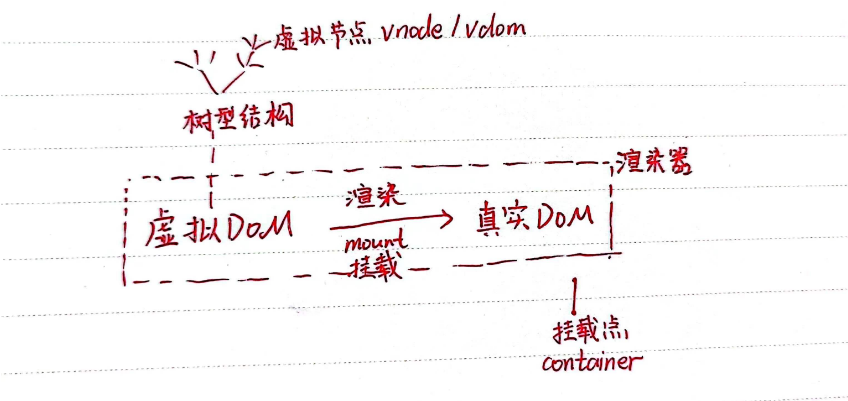
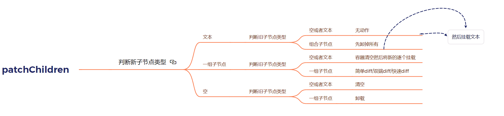
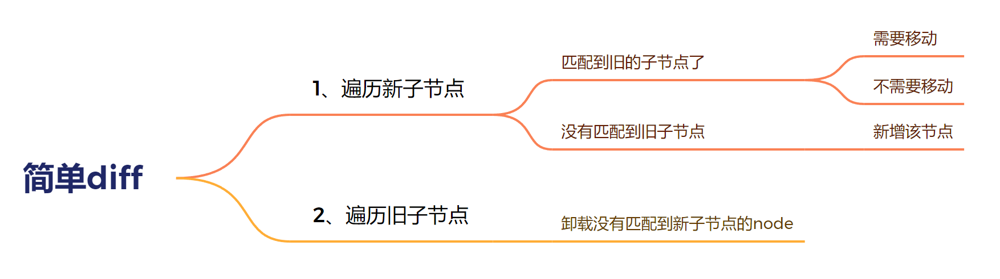

发现了一个很好的可以跟着敲的仓库：https://github.com/Esdiarap/vuejs3Code--HcySunYang-Ver..git

# 渲染器的设计

## 渲染器与响应式系统结合

```html
<!DOCTYPE html>
<html lang="en">

<head>
    <meta charset="UTF-8">
    <title>Title</title>
</head>
<body>
<div id="app"></div>
<script src="https://unpkg.com/@vue/reactivity@3.0.2/dist/reactivity.global.js"></script>
<script>
        const { effect, ref } = VueReactivity;
        function renderer(domString, container) {
            container.innerHTML = domString
        }
        const count = ref(0)
        effect(() => {
            renderer(`<h1>${count.value}</h1>`, document.getElementById('app'))
        })
   
        setTimeout(() => {
            count.value++
        }, 1000)
</script>
</body>
</html>
```

src="https://unpkg.com/@vue/reactivity@3.0.2/dist/reactivity.global.js"  这个是@vue/reactivity提供的响应式API，它暴露的全局API名叫VueReactivity。通过VueReactivity得到了effect和ref这两个API

- 最开始页面显示0，后来1000ms后变成1。

## 自定义渲染器

一些基本概念：



注意：渲染器和渲染不是一回事，渲染器是更宽泛的概念，渲染器不仅可以用来渲染，还可以用来激活已有的DOM元素，这个过程通常发生再同构渲染的情况下。


```html
<!DOCTYPE html>
<html lang="en">

<head>
    <meta charset="UTF-8">
    <title>Title</title>
</head>

<body>
    <div id="app"></div>
    <script>
            const browserOption = {
                createElement(tag) {
                    return document.createElement(tag)
                },
                setElementText(el, text) {
                    el.textContent = text
                },
                insert(el, parent, anchor = null) {
                    parent.insertBefore(el, anchor) // 将el元素插入到parent父元素中，在anchor元素之前
                }
        }
            // 自定义渲染器
            const printOption = {
                createElement(tag) {
                    console.log(`创建元素${tag}`)
                    return { tag }
                },
                setElementText(el, text) {
                    console.log(`设置 ${JSON.stringify(el)} 的文本内容为： ${text}`)
                    el.text = text
                },
                insert(el, parent, anchor) {
                    console.log(`将 ${JSON.stringify(el)} 添加到 ${JSON.stringify(parent)} 下`)
                    parent.children = el
                }
        }
            // 渲染器
            function createRenderer(options = {}) {
                const {
                    createElement,
                    setElementText,
                    insert
                } = options

                // 挂载函数
                function mountElement(vnode, container) {
                    const el = createElement(vnode.type)
                    if (typeof vnode.children === 'string') {
                        setElementText(el, vnode.children)
                    }
                insert(el, container)
            }
            // 补丁函数
            function patch(oldVNode, newVNode, container) {
                if (!oldVNode) {
                    // 挂载
                    mountElement(newVNode, container)
                } else {
                    // 打补丁
                }
            }
            // 渲染函数
            function render(vnode, container) {
                if (vnode) {
                    // 新vnode存在，将其与旧vnode一起传递给patch函数打补丁
                    patch(container._vnode, vnode, container)
                } else {
                    if (container._vnode) {
                        // 新vnode不存在，旧vnode存在，说明是卸载(unmount)操作
                        // 清空DOM
                        container.innerHTML = ''
                    }
                }
                container._vnode = vnode // vnode改成旧的
            }
            // 同构渲染
            function hydrate(vnode, container) {
            }
            return {
                render,
                hydrate
            }
        }
            const vnode = {
                type: 'h1',
                children: 'hello'
            }
            const renderer = createRenderer(browserOption)
            renderer.render(vnode, document.getElementById('app'))
            const rendererPrint = createRenderer(printOption)
            // const container = {type: 'root'}
            rendererPrint.render(vnode, { type: 'root' })


</script>
</body>
</html>
```

为什么要自定义渲染器，而不是写死？ 因为我们的目的是设计一个不依赖于浏览器平台的通用渲染器，document.createElement

， el.textContent ，appendchild是依赖于浏览器的API，不应该直接写在mountElement函数里面，而是抽离出来

作为browserOption。这时候mountElement里面用的相当于都是自己写的函数：createElement, setElementText, insert。这些函数内部就随便定义了，不同平台用不同方法来定义。

渲染器里面的核心是渲染函数！渲染函数用到了patch函数，patch用到了mountElement，mountElement会用到browserOption


# 挂载与更新

为元素设置属性很复杂。

很多HTML Attributes 在DOM对象上有与之同名的DOM Properties。

class="foo" 对应 el.className   id="foo"对应el.id。

实际上HTML Attributes 的作用是设置与之对应的DOM Properties的初始值。一旦值改变，**DOM Properties（el.id）存储着当前值**，而通过getAttributes**（el.getAttributes）函数得到的仍然是初始值**。

核心原则：HTML Attributes 的作用是设置与之对应的DOM Properties的初始值。

...还有一些其他问题，暂不重要。

```html
<!DOCTYPE html>
<html lang="en">
<head>
    <meta charset="UTF-8">
    <title>Title</title>
</head>
<body>
<div id="app"></div>
<script>
    // propsKey 属性是否应该作为DOM Property被设置。
    // true 表示可以使用DOM Property设置，el[propsKey] = xx, false表示只可以用setAttribute设置
    function shouldSetAsProps(el, propsKey, value) {
        // 所有表单元素都具有form属性表示
        if (propsKey === 'form' && el.tagName.toLowerCase() === 'input')
            return false
        return propsKey in el
    }

    // 渲染器
    function createRenderer(options = {}) {
        const {
            createElement,
            setElementText,
            insert,
            patchProps
        } = options

        // 挂载函数
        function mountElement(vnode, container) {
            // 通过vnode的el属性获得真实DOM
            const el = vnode.el = createElement(vnode.type)
            // children处理
            if (typeof vnode.children === 'string') {
                // 如果节点值是string，设置文本
                setElementText(el, vnode.children)
            } else if (Array.isArray(vnode.children)) {
                // children是一个数组，遍历这个数组，数组每个元素都是一个vnode
                // 调用patch将他们挂载上去. oldVNode=null, container = el
                vnode.children.forEach(child => {
                    patch(null, child, el)
                })
            }
            // 设置vnode属性
            if (vnode.props) {
                for (const propsKey in vnode.props) {
                    const value = vnode.props[propsKey];
                    patchProps(el, propsKey, null, value)
                }
            }
            // 将el挂载在container上
            insert(el, container)
        }

        // 更新函数
        function patchElement(oldVNode, newVNode) {
            const el = newVNode.el = oldVNode.el,
                oldProps = oldVNode.props,
                newProps = newVNode.props
            // 更新Props
            for (const key in newProps) {
                if (newProps[key] !== oldProps[key]) {
                    patchProps(el, key, oldProps[key], newProps[key])
                }
            }
            for (const key in oldProps) {
                if (!(key in newProps)) {
                    patchProps(el, key, oldProps[key], null)
                }
            }
            // 更新子节点
            patchChildren(oldVNode, newVNode, el)
        }

        function patchChildren(oldVNode, newVNode, container) {
            // 判断新子节点的类型是否是文本类型
            if (typeof newVNode.children === 'string') {
                // 旧子节点的类型只有三种： 无子节点， 文本子节点， 组合子节点
                if (Array.isArray(oldVNode.children)) {
                    oldVNode.children.forEach(child => unmounted(child))
                }
                setElementText(container, newVNode.children)
            }else if (Array.isArray(newVNode.children)) { // 新子节点的类型是一组子节点
                if (Array.isArray(oldVNode.children)) { // 旧子节点的类型是一组节点
                    // 核心Diff算法比较两个VNode子节点的区别
                    // 此处是简单实现，并非Diff算法
                    oldVNode.children.forEach(child => unmounted(child))
                    newVNode.children.forEach(child => patch(null, child, container))
                }else {
                    // 此时，旧子节点的类型要么是文本类型，要么是无
                    // 但无论那种情况，都需要将容器清空，然后将新的一组子节点逐个挂载
                    setElementText(container, '')
                    newVNode.children.forEach(child => {
                        patch(null, child, container)
                    })
                }
            }else { // newVNode.children === null或者'' 没有新子节点，
                if (Array.isArray(oldVNode.children)) { // 旧子节点是一组节点 就逐个卸载
                    oldVNode.children.forEach(child => unmounted(child))
                } else if (typeof oldVNode.children === 'string') { // 旧子节点是文本节点，就清空内容
                    setElementText(container, '')
                }
            }
        }

        // 补丁函数
        function patch(oldVNode, newVNode, container) {
            // oldVNode存在，新旧vnode的type不同
            if (oldVNode && oldVNode.type !== newVNode.type) {
                unmounted(oldVNode)
                oldVNode = null
            }
            // 代码运行到这说明oldVNode和newVNode的type是相同的
            const {type} = newVNode
            // newVNode type是string, 说明是普通标签元素. 如果type是object，则描述的是组件
            if (typeof type === 'string') {
                if (!oldVNode) {
                    // 挂载
                    mountElement(newVNode, container)
                } else {
                    patchElement(oldVNode, newVNode)
                }
            }else if (typeof type === 'object'){
                // 组件类型的VNode
            }else if (type === 'xxx'){
                // 其他类型的VNode
            }

        }

        // 卸载函数
        function unmounted(vnode) {
            const parent = vnode.el.parentNode
            if (parent) parent.removeChild(vnode.el)
        }

        // 渲染函数
        function render(vnode, container) {
            if (vnode) {
                // 新vnode存在，将其与旧vnode一起传递给patch函数打补丁
                patch(container._vnode, vnode, container)
            } else {
                if (container._vnode) {
                    // 新vnode不存在，旧vnode存在，说明是卸载(unmount)操作
                    // 清空DOM
                    unmounted(container._vnode)
                }
            }
            container._vnode = vnode // vnode改成旧的
        }

        // 同构渲染
        function hydrate(vnode, container) {

        }

        return {
            render,
            hydrate
        }
    }

    // normalizeClass里处理Object.
    function handleObject(set, obj) {
        for (const key in obj) {
            if (obj[key]) set.add(key) // 如果对象的值为true, set里把键(className)加进去
        }
    }

    function normalizeClass(classValue) {
        // 字符串
        if (typeof classValue === 'string') return classValue
        let resultClassSet = new Set()
        // 数组和对象情况
        if (Array.isArray(classValue)) {
            for (const value of classValue) {
                if (typeof value === 'string') resultClassSet.add(value)
                else {
                    // 对象
                    handleObject(resultClassSet, value)
                }
            }
        } else {
            // 对象
            handleObject(resultClassSet, classValue)
        }
        return Array.from(resultClassSet).join(' ').trim()
    }

    const vnode = {
        type: 'div',
        props: {
            id: 'foo',
            class: normalizeClass([
                'ds',
                {
                    test1: true,
                    test2: false,
                    test3: true
                }
            ]),
            onClick: [
                () => {
                    console.log(1)
                },
                () => {
                    console.log(2)
                }
            ]
        },
        children: [
            {
                type: 'h1',
                children: 'hello h1'
            }
        ]
    }
    const renderer = createRenderer({
        createElement(tag) {
            return document.createElement(tag)
        },
        setElementText(el, text) {
            el.textContent = text
        },
        insert(el, parent, anchor = null) {
            parent.insertBefore(el, anchor)
        },
        patchProps(el, propsKey, previousValue, nextValue) {
            if (/^on/.test(propsKey)){ // on开头的属性是事件
                const invokers = el._vei || (el._vei = {})
                // 根据事件名获取invoker
                let invoker = invokers[propsKey]
                const eventName = propsKey.slice(2).toLowerCase()
                if (nextValue) {
                    if (!invoker) { // invoker不存在
                        invoker = el._vei[propsKey] = (event) => { // 伪造的事件处理函数放到el._vei[propsKey]中
                            if (event.timestamp < invoker.attached) return ; // 事件发生的时间 早于 事件处理函数绑定的时间，则不执行事件处理函数
                            if (Array.isArray(invoker.value)) { // invoker.value 是一个数组
                                invoker.value.forEach(fn => fn(event))
                            } else {
                                invoker.value(event) // 当伪造事件处理函数invoker执行的时候，会执行内部真正的事件处理函数invoker.value,传递event进去
                            }
                        }
                        invoker.value = nextValue // 真正的事件处理函数赋值给invoker.value
                        invokers.attached = performance.now() // 事件绑定时间
                        el.addEventListener(eventName, invoker)
                    }else {
                        // invoker存在，nextValue存在，那就是更新。把伪造事件处理函数invoker的value更新
                        invoker.value = nextValue
                    }
                }else if (invoker) { // nextValue不存在，而invoker存在，说明要把原来的事件移除绑定
                    el.removeEventListener(eventName, invoker)
                }
            }
            if (propsKey === ' class') {
                el.className = nextValue
            } else if (shouldSetAsProps(el, propsKey, nextValue)) { // HTML Attribute 跟 DOM Property有对应
                const type = typeof el[propsKey]

                // 如果type 是布尔类型的值而且value是空字符串，说明应该设置为true，而不是false
                if (type === 'boolean' && nextValue === '') el[propsKey] = true // 矫正设置DOM Property
                else el[propsKey] = nextValue // 设置DOM Property

            } else { // HTML Attribute 和 DOM Property 没对应，比如class 和 className
                el.setAttribute(propsKey, vnode.props[propsKey])
            }
        }
    })
    renderer.render(vnode, document.getElementById('app'))

</script>
</body>
</html>
```

# Diff



diff部分就是在新旧子节点都是一组子节点的情况下探讨的

## 简单Diff

需要更新的新旧节点如下

```js
  const oldVNode = {
        type: 'div',
        children: [
            {type: 'p', children: '1', key: 1},
            {type: 'p', children: '2', key: 2},
            {type: 'p', children: '4', key: 3}
        ]
    }
    const newVNode = { // 1 -> 5, 2 -> 6, 3 -> 4
        type: 'div',
        children: [
            {type: 'p', children: '4', key: 3},
            {type: 'p', children: '5', key: 1},
            {type: 'p', children: '6', key: 2},
        ]
    }
```

更新函数如下：



```js
function patchChildren(oldVNode, newVNode, container) {
    // 判断新子节点的类型是否是文本类型
    if (typeof newVNode.children === 'string') {//如果是
        if (Array.isArray(oldVNode.children)) {  //如果旧子节点是组合子节点类型，则先把每一个都卸载掉
            oldVNode.children.forEach(child => unmounted(child))
        }
        if (oldVNode.children !== newVNode.children)//然后再去挂载文本
            setElementText(container, newVNode.children)
    } else if (Array.isArray(newVNode.children)) { // 新子节点的类型是一组子节点
        if (Array.isArray(oldVNode.children)) { // 旧子节点的类型是一组节点
            // 简单Diff
            const oldChildren = oldVNode.children,
                newChildren = newVNode.children,
                oldLen = oldChildren.length,
                newLen = newChildren.length
            let lastIndex = 0
            for (let i = 0; i < newLen; i++){ //遍历新子节点
                const newVNode = newChildren[i]
                let j = 0,
                    find = false // 是否匹配的标志
                for (j; j < oldLen; j++) { // 遍历通过key匹配oldVNode
                    const oldVNode = oldChildren[j]
                    if (newVNode.key === oldVNode.key) {
                        find = true // 匹配上 则find为true
                        patch(oldVNode, newVNode, container)
                        if (j < lastIndex) { // 旧vnode对应的索引要比最大索引值小，说明该vnode对应的真实dom要移动了/举例来说新的vnode排序是ab，旧的是ba，也就是说在遍历新的vnode的时候，遍历到b时，发现b旧的index比a旧的index小，这不对，所以要进行移动，把b移到a的后面。
                            const prevNode = newChildren[i - 1] // 获取前一个newVNode
                            // 如果前一个newVNode不存在，那说明当前的newVNode是第一个节点，不需要移动
                            if (prevNode) {
                                const anchor = prevNode.el.nextSibling // 找到锚点
                                insert(newVNode.el, container, anchor) // 插入. 这里用newVNode.el或者oldVNode.el都是一样的
                            }
                        }else {
                            lastIndex = j
                        }
                        break // break退出去
                    }
                }
                if (!find) { // 该newVNode 没有匹配到oldVNode--需要增加的情况
                    const prevNode = newChildren[i - 1]
                    let anchor = null
                    if (prevNode) { // 前一个newVNode存在
                        anchor = prevNode.el.nextSibling
                    } else { // 该newVNode是第一个而且没匹配到oldVNode
                        anchor = container.firstChild
                    }
                    // 挂载newVNode
                    patch(null, newVNode, container, anchor)
                }
            }

            // 上一步是更新newVNode，更新完之后遍历oldVnode,查看是否有没匹配的节点
            // 如果有就删掉这个oldVnode
            for (let i = 0; i < oldLen; i++) {
                const oldVnode = oldChildren[i]
                const has = newChildren.find(newVnode => newVnode.key === oldVnode.key)
                if (!has) { // 此oldVnode没有匹配任何的newVnode, 就要吧这个oldVnode删掉
                    unmounted(oldVnode.el)
                }
            }
        } else {
            // 此时，旧子节点的类型要么是文本类型，要么是无
            // 但无论那种情况，都需要将容器清空，然后将新的一组子节点逐个挂载
            setElementText(container, '')
            newVNode.children.forEach(child => {
                patch(null, child, container)
            })
        }
    } else { // newVNode.children === null或者'' 没有新子节点，
        if (Array.isArray(oldVNode.children)) { // 旧子节点是一组节点 就逐个卸载
            oldVNode.children.forEach(child => unmounted(child))
        } else if (typeof oldVNode.children === 'string') { // 旧子节点是文本节点，就清空内容
            setElementText(container, '')
        }
    }
}
```

本质上是对旧子节点调换顺序，找到可复用的节点，移动到该去的位置。

从新节点开始遍历，

- 对于第一个新节点，如果它可复用，那么它对应的旧节点a不变动位置；如果它不可复用，那么新创建一个a放在头部位置
- 对于第二个新节点，如果可复用，那么观察它对应的旧节点b是不是在a后头，如果不是，就要移动过去，以保证ab的顺序。如果它不可复用，那么就创建一个b放到a后面。
- 重复上述过程，就把旧节点都排序好了。
- 但是有一个问题是，我们遍历的是新节点，所以刚刚的过程没法确定旧节点中有没有被删掉的节点，所以还得遍历一遍旧节点，删掉需要删掉的。

（从新子节点开始一个一个遍历，如果发现可复用，就把它移动到正确的位置，如果不可复用就新创建一个，最后再循环一下旧子节点，看有没有需要删除的）

## 双端Diff

```js
function patchChildren(oldVNode, newVNode, container) {
    // 判断新子节点的类型是否是文本类型
    if (typeof newVNode.children === 'string') {
        // 旧子节点的类型只有三种： 无子节点， 文本子节点， 组合子节点
        if (Array.isArray(oldVNode.children)) {
            oldVNode.children.forEach(child => unmounted(child))
        }
        // 书上没有的，此处自己理解： 如果oldVNode和newVNode children一致, 才调用setElementText
        // 不然就不需要调用。因为oldVNode的children要么没有，要么是文本子节点
        if (oldVNode.children !== newVNode.children)
            setElementText(container, newVNode.children)
    } else if (Array.isArray(newVNode.children)) { // 新子节点的类型是一组子节点
        if (Array.isArray(oldVNode.children)) { // 旧子节点的类型是一组节点
            // 双端Diff
            const oldChildren = oldVNode.children,
                newChildren = newVNode.children

            // 四个端点
            let oldStartIndex = 0,
                newStartIndex = 0,
                oldEndIndex = oldChildren.length - 1,
                newEndIndex = newChildren.length - 1

            // 四个节点
            let oldStartVnode = oldChildren[oldStartIndex],
                oldEndVnode = oldChildren[oldEndIndex],
                newStartVnode = newChildren[newStartIndex],
                newEndVnode = newChildren[newEndIndex]

            // 循环比较
            while (oldStartIndex <= oldEndIndex && newStartIndex <= newEndIndex) {
                // 处理oldStartVnode的undefined情况
                if (!oldStartVnode) { // oldStartVnode已经被处理过了
                    oldStartVnode = oldChildren[++oldStartIndex]
                }else if (!oldEndVnode) { // oldEndVnode已经被处理过了
                    oldEndVnode = oldChildren[--oldEndIndex]
                }else if (oldStartVnode.key === newStartVnode.key) { // 四个步骤 1
                    patch(oldStartVnode, newStartVnode, container)
                    oldStartVnode = oldChildren[++oldStartIndex]
                    newStartVnode = newChildren[++newStartIndex]
                }else if (oldEndVnode.key === newEndVnode.key) { // 2
                    patch(oldEndVnode, newEndVnode, container)
                    oldEndVnode = oldChildren[--oldEndIndex]
                    newEndVnode = newChildren[--newEndIndex]
                }else if (oldStartVnode.key === newEndVnode.key) { // 3
                    patch(oldStartVnode, newEndVnode, container)
                    insert(oldStartVnode.el, container, oldEndVnode.el.nextSibling) // 放到当前oldEndVnode.nextSibling前面
                    oldStartVnode = oldChildren[++oldStartIndex]
                    newEndVnode = newChildren[--newEndIndex]
                }else if (oldEndVnode.key === newStartVnode.key) { // 4
                    patch(oldEndVnode, newStartVnode, container) // 更新
                    insert(oldEndVnode.el, container, newStartVnode.el) // 移动oldVnode 最后到最前
                    oldEndVnode = oldChildren[--oldEndIndex]
                    newStartVnode = newChildren[++newStartIndex]
                }else {
                    // 都没有找到，就拿newChildren第一个newVnode到oldChildren里找
                    const indexInOld = oldChildren.findIndex(oldVnode => oldVnode.key === newStartVnode.key)
                    if (indexInOld > 0) { // 找到了. findIndex没找到返回-1, 而这里是拿newStartVnode来找，所以如果找到 index 必定大于0
                        const vnodeToMove = oldChildren[indexInOld]
                        patch(vnodeToMove, newStartVnode, container) // 更新
                        insert(vnodeToMove.el, container, oldStartVnode.el)
                        oldChildren[indexInOld] = undefined // 将该oldVnode赋值为undefined表示已经处理过了
                    }else { // 没找到 挂载该newVnode, 并继续往下
                        patch(null, newStartVnode, container, oldStartVnode.el) // anchor = oldStartVnode.el
                    }
                    newStartVnode = newChildren[++newStartIndex] // 更新newStartVnode和newStartIndex
                }
            }

            // 循环比较完之后判断
            if (newStartIndex <= newEndIndex && oldEndIndex < oldStartIndex) { // 说明有剩余的newVnode
                // 挂载, anchor = oldStartVnode.el
                for (let i = newStartIndex; i <= newEndIndex; i++) {
                    patch(null, newChildren[i], container, oldStartVnode.el)
                }
            }else if (newStartIndex > newEndIndex && oldStartIndex <= oldEndIndex) { // 说明有剩余的oldVnode
                // 卸载
                for (let i = oldStartIndex; i <= oldEndIndex; i++) {
                    unmounted(oldChildren[i])
                }
            }
        } else {
            // 此时，旧子节点的类型要么是文本类型，要么是无
            // 但无论那种情况，都需要将容器清空，然后将新的一组子节点逐个挂载
            setElementText(container, '')
            newVNode.children.forEach(child => {
                patch(null, child, container)
            })
        }
    } else { // newVNode.children === null或者'' 没有新子节点，
        if (Array.isArray(oldVNode.children)) { // 旧子节点是一组节点 就逐个卸载
            oldVNode.children.forEach(child => unmounted(child))
        } else if (typeof oldVNode.children === 'string') { // 旧子节点是文本节点，就清空内容
            setElementText(container, '')
        }
    }
}

```

[vue3 - diff算法之双端diff算法 - 掘金 (juejin.cn)](https://juejin.cn/post/7139386449949884447#heading-18)

上面这个博客讲解得比较完整。

双端Diff算法就是同时对新旧两组子节点两个端点进行比较的算法。

1、首先比较新旧子节点的头和尾的key，新头旧头、新尾旧尾、新头旧尾和新尾旧头，一共四次。如果key相同则可以复用，不同则不可以复用。在可复用的情况下，要判断需不需要移动真实的dom来完成更新。（前两者不需要移动，后两者需要）

2、如果头尾匹配，匹配不到，那么拿新的一组子节点的头部节点去旧的一组子节点中查找。找到之后移动上去就可以了。

3、当旧子节点的头尾指针发生交叉，而新子节点的头尾指针没有交叉或者说仅是重合了，这就说明，遗留了新节点没有挂载上。

4、反之说明有旧子节点没有删除。


## 快速Diff

vue2使用的是双端diff，vue3把底层的diff算法改成了快速diff。

```js
function patchChildren(oldVNode, newVNode, container) {
    // 判断新子节点的类型是否是文本类型
    if (typeof newVNode.children === 'string') {
        // 旧子节点的类型只有三种： 无子节点， 文本子节点， 组合子节点
        if (Array.isArray(oldVNode.children)) {
            oldVNode.children.forEach(child => unmounted(child))
        }
        // 书上没有的，此处自己理解： 如果oldVNode和newVNode children一致, 才调用setElementText
        // 不然就不需要调用。因为oldVNode的children要么没有，要么是文本子节点
        if (oldVNode.children !== newVNode.children)
            setElementText(container, newVNode.children)
    } else if (Array.isArray(newVNode.children)) { // 新子节点的类型是一组子节点
        if (Array.isArray(oldVNode.children)) { // 旧子节点的类型是一组节点
            // 快速Diff算法
            const newChildren = newVNode.children,
                oldChildren = oldVNode.children

            // 处理相同的前置, j指向两个Children的开头
            let j = 0,
                newVnode = newChildren[j],
                oldVnode = oldChildren[j]
            while (oldVnode.key === newVnode.key) {
                patch(oldVNode, newVnode, container) // 更新vnode
                j++ // 更新索引
                newVnode = newChildren[j]
                oldVnode = oldChildren[j]
            }

            // 处理相同的后置
            let oldEndIdx = oldChildren.length - 1,
                newEndIdx = newChildren.length - 1
            oldVnode = oldChildren[oldEndIdx] // 重新赋值oldVnode 和 newVnode
            newVnode = newChildren[newEndIdx]
            while (oldVnode.key === newVnode.key) {
                patch(oldVNode, newVNode, container)
                oldEndIdx--
                newEndIdx--
                oldVnode = oldChildren[oldEndIdx]
                newVnode = newChildren[newEndIdx]
            }

            // 处理完相同的前置和后置之后进行判断
            if (j <= newEndIdx && j > oldEndIdx) { // 有newVnode需要挂载，而oldVnode已经全都处理完了
                const anchorIdx = newEndIdx + 1
                const anchor = anchorIdx < newChildren.length ? newChildren[anchorIdx].el : null // 如果超出了newChildren.length 那就直接挂载在后面
                while (j <= newEndIdx) {
                    patch(null, newChildren[j++], container, anchor)
                }
            } else if (j > newEndIdx && j <= oldEndIdx) { // oldVnode需要卸载，newVnode已经全部处理完了
                while (j <= oldEndIdx) {
                    unmounted(oldChildren[j++])
                }
            } else { // 移动DOM判断
                const count = newEndIdx - j + 1 // count是没有被处理的newVnode的个数
                const source = new Array(count).fill(-1) // source数组

                // oldStart和newStart分别为起始索引，即j
                const oldStart = j
                const newStart = j
                const keyIndex = {} // 索引表
                // moved表示该节点需要移动，pos表示遍历旧的子节点中遇到的最大索引值k
                let moved = false
                let pos = 0
                for (let i = newStart; i < newEndIdx; i++) {
                    keyIndex[newChildren[i].key] = i
                }
                // patched表示更新过的节点的数量
                let patched = 0
                for (let i = oldStart; i < oldEndIdx; i++) {
                    oldVNode = oldChildren[i]
                    // 通过索引表快速找到新的一组子节点中具有相同key的节点的位置
                    if (patched <= count) {
                        const k = keyIndex[oldVNode.key]
                        if (typeof k !== 'undefined') { // 找到有
                            newVNode = newChildren[k]
                            patch(oldVNode, newVNode, container)
                            // 每更新一个节点,patched + 1
                            patched++
                            source[k - newStart] = i
                            // 判断节点是否需要移动
                            if (k < pos) {
                                moved = true
                            }else {
                                pos = k
                            }
                        }else {
                            unmounted(oldVNode)
                        }
                    }else { // 更新过的节点大于需要更新的节点，则卸载多余的节点
                        unmounted(oldVNode)
                    }
                }
            }
        }
    } else { // newVNode.children === null或者'' 没有新子节点，
        if (Array.isArray(oldVNode.children)) { // 旧子节点是一组节点 就逐个卸载
            oldVNode.children.forEach(child => unmounted(child))
        } else if (typeof oldVNode.children === 'string') { // 旧子节点是文本节点，就清空内容
            setElementText(container, '')
        }
    }
}

```


快速diff

1、会先把新节点组和旧节点组头尾相同的部分处理掉。

2、对于剩下节点，它会使用一个source数组记录新子节点在原来旧节点组中的位置索引。对于新增的新子节点赋成-1即可。

3、然后使用source数组计算出来最长递增子序列。

4、新节点组从后往前遍历，如果source里面索引是-1就创建新增它；如果不在递增子序列里面，那么就移动它；如果在新增子序列里面那么就复用但不不移动
